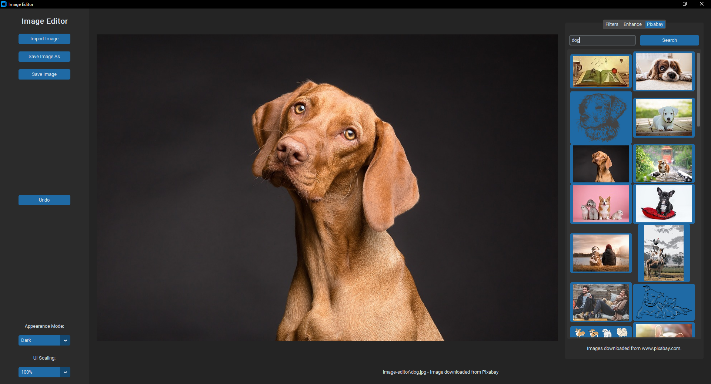

# Image Editor Application


The Image Editor Application is a Python GUI program built using the Tkinter library. It allows users to load images, apply various filters and enhancements, and save their edited images. This README provides an overview of the application, how to use it, and how to contribute.



## Features

- Load images from your local filesystem.
- Apply a variety of filters to your images, such as blur, sharpen, and more.
- Enhance your images by adjusting color, contrast, brightness, and sharpness.
- Flip and mirror your images.
- Search for images on Pixabay and import them into the application.

## Prerequisites

Before running the Image Editor Application, make sure you have the following dependencies installed:

- Python (>=3.6)
- tkinter (usually included with Python, no additional installation required)
- PIL (Python Imaging Library)
- requests

You can install the required packages using pip:

```bash
pip install pillow requests

## License
This project is licensed under the MIT License - see the LICENSE file for details.

## Acknowledgments
This application was built using Tkinter for the GUI.
Pixabay integration powered by the Pixabay API.